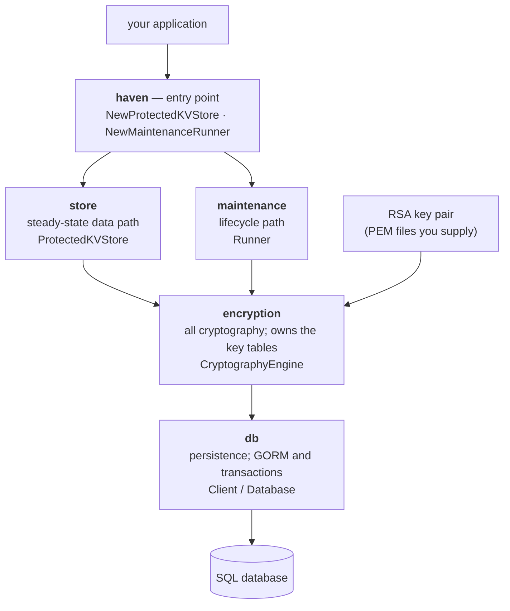

# `haven` — encrypted-at-rest, versioned key-value storage for Go

[](https://github.com/alwitt/haven/actions/workflows/cicd.yaml)
[](https://go.dev/)
[](./LICENSE)

`haven` is an **embeddable Go library** for applications that must persist secrets —
credentials, tokens, configuration containing either — and want them encrypted at rest
without taking on a key management service as a dependency.

Point it at a SQL database and one RSA key pair, and you get a key-value API that
transparently encrypts every value it stores and decrypts every value it reads. The
embedding application never touches key material, never chooses a cipher, and never sees a
nonce.

> The full architecture — layering, data model, cryptography, the system lifecycle and the
> maintenance actions, with the reasoning behind each — lives in [`DESIGN.md`](DESIGN.md).
> This README is the short path to running one.

## What it gives you

- **Values are encrypted at rest.** Plain text is never written to the database, and the
  symmetric key material itself is stored only in wrapped form.
- **Values are versioned.** Recording a key appends a new version rather than overwriting
  the previous one. History is retained until the record is deleted.
- **Values are bound to their row.** A cipher text cannot be moved to a different record, a
  different version, or re-associated with a different key without failing authentication.
- **Lifecycle events are audited.** Key creation, retirement and deletion, record creation
  and deletion, and rotation boundaries land in an append-only table.

## What it is not

- **Not a service.** No network API, no daemon, no RPC. It runs inside your process.
- **Not an access control system.** Anyone who can call the API can read every value. If
  your application needs authorization, it implements it.
- **Not multi-tenant.** One database is one store. Two `haven` instances on the same
  database are copies of each other, not isolated tenants.
- **Not a KMS.** You supply the RSA key pair as PEM files. `haven` does not generate it,
  store it, or protect it beyond holding the parsed private key in process memory.

## How the pieces fit



`store` and `maintenance` are siblings: `store` is the steady-state data path, `maintenance`
is the lifecycle path, and they are never active at the same time. Underneath both,
`encryption` is the only component that holds your key pair or touches key material, and
`db` is the only one that talks to the database. A fifth package, `models`, holds the
entities, state ENUMs and error types every layer shares.

**Envelope encryption** is what makes rotation tractable. Your RSA key pair — the **KEK** —
never encrypts record data; its only job is to wrap and unwrap the symmetric **DEKs** that
do. Rotating the KEK therefore re-wraps one row per DEK and leaves every record untouched.

| Role | Algorithm |
|---|---|
| Key wrapping (KEK) | RSA-OAEP, SHA-512 MGF1 — key size set by your certificate |
| Record values (DEK) | XChaCha20-Poly1305 (IETF) — 32-byte key, 24-byte nonce, 16-byte tag |
| Randomness | libsodium CSPRNG |

Primitives come from [`cgoutils/crypto`](https://github.com/alwitt/cgoutils), which wraps
libsodium. See [DESIGN §4](DESIGN.md#4-cryptography) for the key hierarchy, the certificate
checks applied on load, and the associated-data binding.

## Requirements

- **Go 1.26+**, module `github.com/alwitt/haven`.
- **cgo and libsodium.** The cryptography is libsodium through `cgoutils`, which links with
  `pkg-config`, so the development package must be present at build time —
  `libsodium-dev` on Debian/Ubuntu, `libsodium-devel` on Fedora/RHEL. Builds with
  `CGO_ENABLED=0` will not work.
- **A SQL database.** SQLite for development and tests; PostgreSQL in production.
- **An RSA key pair**, as a certificate PEM and a private key PEM. A CA bundle PEM is
  optional; supply one and the certificate must chain to a self-signed root in it.

```sh
go get github.com/alwitt/haven
```

## Quick start

```go
import (
    "github.com/alwitt/haven"
    "github.com/alwitt/haven/db"
    "gorm.io/gorm/logger"
)

// Development schema. Postgres uses the Atlas migrations instead — see Persistence below.
persistence, err := db.NewConnection(db.GetSqliteDialector("/var/lib/myapp/haven.db"), logger.Warn)
if err != nil {
    return err
}
if err := persistence.RunSQLInTransaction(ctx, db.DefineTables); err != nil {
    return err
}

caBundle := "/etc/myapp/ca-chain.crt"
params := haven.ProtectedKVStoreParams{
    DBDialector:          db.GetSqliteDialector("/var/lib/myapp/haven.db"),
    DBLogLevel:           logger.Warn,
    PrimaryRSACertFile:   "/etc/myapp/kek.crt",
    PrimaryRSAKeyFile:    "/etc/myapp/kek.key",
    PrimaryRSACACertFile: &caBundle, // optional; nil checks only the validity window
    KeyCacheTTL:          time.Minute,
}

// A new store is closed for business until a maintenance action mints its first
// encryption key. This is a one-time step, not something to run at every startup.
runner, _, err := haven.NewMaintenanceRunner(ctx, params, 0)
if err != nil {
    return err
}
if err := runner.Initialize(ctx); err != nil {
    return err
}

kvStore, dbClient, err := haven.NewProtectedKVStore(ctx, params)
if err != nil {
    return err
}

// Write. The trailing nil means "open your own transaction"
_, version, err := kvStore.RecordKeyValue(ctx, "api-token", []byte("s3cret"), time.Now(), nil)

// Read it back
value, err := kvStore.GetValueOfKeyAtVersionID(ctx, version.ID, nil)

// The versions of a key, newest first
_, versions, err := kvStore.ListKeyVersions(ctx, "api-token", nil)

// Delete the key and every version of it
err = kvStore.DeleteKey(ctx, "api-token", nil)
```

Both constructors also hand back a `db.Client`. Keep it: it is how you read the audit log
and how you compose KV writes into your own transactions, both shown below.

## Usage patterns

### Initialization is a maintenance action, not a constructor

`NewProtectedKVStore` mints no keys. It refuses to construct unless the system is `READY`,
naming the state it found, and it reports the problem at startup rather than at the first
write — where your application has somewhere sensible to surface it.

Minting the first key belongs to `Initialize` because two application instances starting
against an empty database would otherwise race and both mint one. Run it once, out of band,
when the store is created. See [DESIGN §8.3](DESIGN.md#83-the-kv-store-constructor-checks-state-and-stops-minting-keys).

### Values are versioned

`RecordKeyValue` appends. Calling it twice for the same key leaves two versions, both
readable, and `ListKeyVersions` returns them newest first. `GetValueOfKeyAtVersionID`
fetches a version by ID and decrypts it; `GetValueOfKeyAtVersion` decrypts a version you
already hold, without touching the database:

```go
_, versions, err := kvStore.ListKeyVersions(ctx, "api-token", nil)
current, err := kvStore.GetValueOfKeyAtVersion(ctx, versions[0], nil)
```

Deleting a key deletes its versions with it. There is no way to delete one version of a
live key through the KV API.

### Composing with your own transaction

Every `store` method takes a trailing `activeDBClient`. Passing `nil` means "open your own
transaction"; passing a live `db.Database` means "join the one I already have" — so a
secret and the application rows that refer to it commit or roll back together:

```go
err := dbClient.UseDatabaseInTransaction(ctx, func(ctx context.Context, tx db.Database) error {
    if _, _, err := kvStore.RecordKeyValue(ctx, "api-token", secret, time.Now(), tx); err != nil {
        return err
    }
    return myOwnWrite(ctx, tx) // your rows, same transaction
})
```

Whoever opens the transaction owns the commit: a method called with a non-nil
`activeDBClient` does not open one, so it cannot commit one
([DESIGN §2.2](DESIGN.md#22-transactions-compose-through-activedbclient)).

### Errors

Every error type derives from `goutils.BaseError` and implements `Unwrap`, so matching is
`errors.As` and works through any depth of wrapping. Each layer stamps its own type at its
public boundary — `models.KVStoreError` from `store`, `models.EncryptionError` from
`encryption`, `models.MaintenanceError` from `maintenance` — and everything underneath
survives, so the outermost name says which layer you asked, and the inner ones say why it
could not:

```go
_, _, err := kvStore.ListKeyVersions(ctx, "api-token", nil)

var notFound goutils.NotFoundError
if errors.As(err, &notFound) {
    // no such key — reached straight through the store's own wrapping
}
```

The full taxonomy is [DESIGN §11](DESIGN.md#11-error-taxonomy).

### Reading the audit log

Lifecycle history is a table, reachable through the `db.Client` the constructors return.
Events come back oldest first, and both timestamp bounds are **inclusive**:

```go
err := dbClient.UseDatabase(ctx, func(ctx context.Context, tx db.Database) error {
    events, err := tx.ListSystemEvents(ctx, db.SystemEventQueryFilter{
        EventTypes:  []models.SystemEventTypeENUMType{models.SystemEventTypeDeleteRecord},
        EventsAfter: &since,
    })
    // ... each event's Metadata parses with event.ParseMetadata(validator)
    return err
})
```

`SystemEventQueryFilter` also carries `EventsBefore` and `Limit`/`Offset` paging. The event
types and the metadata each one carries are listed in
[DESIGN §10](DESIGN.md#10-audit-log).

## Maintenance actions

The operations that change cryptographic material live on a separate `maintenance.Runner`,
built from the same parameters:

```go
runner, _, err := haven.NewMaintenanceRunner(ctx, params, 0) // 0 = default page size

// What state is the system in, and is any work outstanding?
status, err := runner.Status(ctx)

// Prepare a brand new store for use. One time, at creation.
err = runner.Initialize(ctx)

// Replace the encryption key and move every record version onto the new one
err = runner.RotateEncryptionKey(ctx)

// Re-wrap every encryption key under a new RSA key pair. Record data is untouched.
err = runner.RotateKEK(ctx, encryption.KEKParams{
    CertFile: "/etc/myapp/kek-new.crt",
    KeyFile:  "/etc/myapp/kek-new.key",
})
```

`Status` is the one to reach for first: it reports the system state, the active and retired
keys, how many record versions a rotation still has to move, how many keys are still under
another KEK, and whether the `READY` invariant holds.

**Operating constraints.** These are requirements on you, not properties `haven` can
enforce — it is a library with no way to coordinate across processes
([DESIGN §7.4](DESIGN.md#74-operating-constraints)):

- **No instance of the embedding application may run while an action is in progress.**
  There are guard rails that bound the damage when this is broken; they do not make
  breaking it safe.
- **Rotations roll forward only.** Once the conversion has moved its first row, the old
  cipher text or wrapping is gone for that row. An interrupted rotation is rerun to
  completion by calling the same method again — not abandoned.
- **An interrupted action leaves the system blocked.** The state stays at
  `…_IN_PROGRESS` and KV stores refuse to open, naming the state. That is deliberate
  fail-closed behaviour, not corruption.
- **Restart after a KEK rotation.** The engine keeps the pair it was constructed with for
  the whole rotation, so the application must be restarted with the new pair configured
  once it completes.

A rotation halts if it meets a record version that will not decrypt. The runner's
`ListUndecryptableVersions` reports the full extent of the damage and
`PurgeUndecryptableVersions` destroys what cannot be recovered; read
[DESIGN §7.2.1](DESIGN.md#721-versions-that-cannot-be-re-encrypted) before running the
second one.

## Persistence

`haven` talks to the database through [GORM](https://gorm.io).

**SQLite** backs development and the tests. Use
[`db.GetSqliteDialector`](db/client.go) rather than building a dialector yourself — it
appends `?_foreign_keys=on`, which is required, because SQLite does not enforce foreign keys
by default and `haven` depends on one of them to refuse a key deletion that would destroy
data. `db.DefineTables` creates the schema directly and is the development path.

**PostgreSQL** is the production target. Its schema is managed by
[Atlas](https://atlasgo.io/) migrations generated from the GORM models and kept in
[`migrations/`](migrations/):

```sh
make gen-migrate    # diff the models against migrations/ and write a new versioned SQL file
make dev-migrate    # apply them to the local development Postgres
```

A development Postgres and the migration image are in
[`docker/docker-compose.yml`](docker/docker-compose.yml) — `make up` / `make down`.

## Development

```sh
make test             # go test ./...
make test-package PKG=store
make one-test FILTER=TestProtectedKVStoreEndToEnd
make lint             # revive + golangci-lint
make mock             # regenerate the mockery mocks under mocks/
make gen-test-certs   # regenerate the x509 fixtures in test/certs/
```

Every target is in the [`Makefile`](Makefile); `make help` lists them.

## License

Released under the [MIT License](LICENSE).
